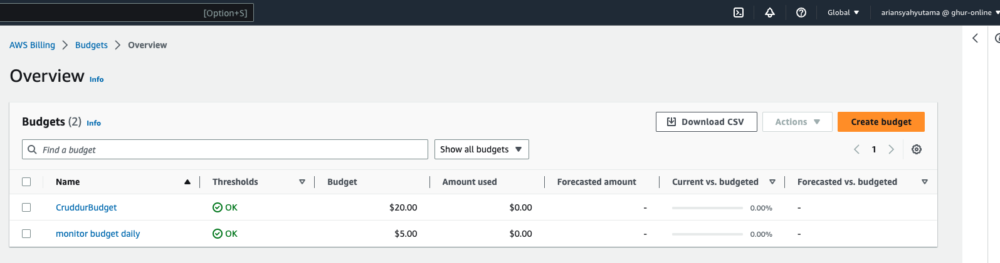
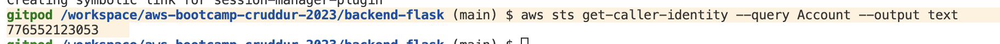

# Week 0 — Billing and Architecture

in this week-0,  
* We are going to create conceptual, logical and physical design. I created the designs by using free lucid chart version.
* Setting up AWS account including IAM user and Gropus (I have the account already few months before the bootcampt was started)
* Setting up Gitpod
* setting budget and alarm
* 
## Conceptual Design
I should not put a specific service in the conceptual design, general infomation for example Storage, Authentication or CDN should be good.


## Logical Design

I added CI/CD pipiline in the diagram, one of the function of the pipiline is to automate the deployment of ECS.
I put API gateway so the client in internet will communicate with the API gateway first, also I included the ACM for the certificate manager.


source : 
https://lucid.app/lucidchart/3c298bb3-1036-4996-8ee2-f5ae08e54a1b/edit?viewport_loc=-3163%2C98%2C937%2C974%2C0_0&invitationId=inv_1369f12b-7802-4162-a901-35cb4ae95af2


## Budget Limit 
I put daily budget monitoring max USD 5 and monthly max  USD 20, one day I got charge up to 80 USD.



### Create an AWS Budget using CLI

[aws budgets create-budget](https://docs.aws.amazon.com/cli/latest/reference/budgets/create-budget.html)

Get your AWS Account ID
```sh
aws sts get-caller-identity --query Account --output text
```
the output will be our AWS account ID as follows



next we are going to deploy our aws budget by using AWS CLI.

```sh
aws budgets create-budget \
    --account-id $AWS_ACCOUNT_ID \
    --budget file://aws/json/budget.json \
    --notifications-with-subscribers file://aws/json/budget-notifications-with-subscribers.json
```

content of budget.json file are bolow
```
{
    "BudgetLimit": {
        "Amount": "20",
        "Unit": "USD"
    },
    "BudgetName": "CruddurBudgetMontly",
    "BudgetType": "COST",
    "CostFilters": {
        "TagKeyValue": [
            "user:project$cruddur"
        ]
    },
    "CostTypes": {
        "IncludeCredit": true,
        "IncludeDiscount": true,
        "IncludeOtherSubscription": true,
        "IncludeRecurring": true,
        "IncludeRefund": true,
        "IncludeSubscription": true,
        "IncludeSupport": true,
        "IncludeTax": true,
        "IncludeUpfront": true,
        "UseBlended": false
    },
    "TimePeriod": {
        "Start": 1477958399,
        "End": 3706473600
    },
    "TimeUnit": "MONTHLY"
  }
```

content of budget-notifications.json are below
```
[
    {
        "Notification": {
            "ComparisonOperator": "GREATER_THAN",
            "NotificationType": "ACTUAL",
            "Threshold": 80,
            "ThresholdType": "PERCENTAGE"
        },
        "Subscribers": [
            {
                "Address": "ghurafa2821@gmail.com",
                "SubscriptionType": "EMAIL"
            }
        ]
    }
]
```

## Add user on IAM


## caller identity


## Creating a Billing Alarm

### Create SNS Topic

- We need an SNS topic before we create an alarm.
- The SNS topic is what will delivery us an alert when we get overbilled
- [aws sns create-topic](https://docs.aws.amazon.com/cli/latest/reference/sns/create-topic.html)

We'll create a SNS Topic
```sh
aws sns create-topic --name billing-alarm
```
which will return a TopicARN for example "TopicArn": "arn:aws:sns:us-east-1:776552123053:billing-alarm"

We'll create a subscription supply the TopicARN and our Email
```sh
aws sns subscribe \
    --topic-arn "arn:aws:sns:us-east-1:776552123053:billing-alarm" \
    --protocol email \
    --notification-endpoint ghurafa2821@gmail.com
```

Check your email and confirm the subscription

#### SNS


#### Create Alarm

- [aws cloudwatch put-metric-alarm](https://docs.aws.amazon.com/cli/latest/reference/cloudwatch/put-metric-alarm.html)
- [Create an Alarm via AWS CLI](https://aws.amazon.com/premiumsupport/knowledge-center/cloudwatch-estimatedcharges-alarm/)
- We need to update the configuration json script with the TopicARN we generated earlier
- We are just a json file because --metrics is is required for expressions and so its easier to us a JSON file.

```sh
aws cloudwatch put-metric-alarm --cli-input-json file://aws/json/alarm_config.json
```


